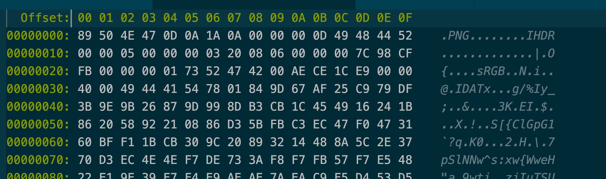

## Chunks

_The main goal of `png-as` is to efficiently process chunks._

> Chunks were designed to be easily tested and manipulated by computer programs, easily detected by human eyes, and reasonably self-contained. Every chunk has the same structure: a 4-byte length (in ``big-endian'' format, as with all integer values in PNG streams), a 4-byte chunk type, between 0 and 2,147,483,647 bytes of chunk data, and a 4-byte cyclic redundancy check value (CRC).

- Length(the length of the data field alone): 4 bytes
- Type: 4 bytes
- Chunk data: 0 ~ 2,147,483,647 bytes
- Cyclic redundancy check value (CRC, covers both the chunk-type field and the chunk data): 4 bytes

For example, if you had a png that looks like:


You can decode it as follows:

```
89 50 4E 47 0D 0A 1A 0A # Header
00 00 00 0D # Chunk 1 Data length (= 13 byte)
49 48 44 52 # Chunk 1 type
00 00 05 00 00 00 03 20 08 06 00 00 00 # Chunk 1 Data
7C 98 CF FB # Chunk 1 CRC
00 00 00 01 # Chunk 2 Data length (= 1 byte)
73 52 47 42 # Chunk 2 Type
00 # Chunk 2 data
AE CE 1C E9 # Chunk 2 CRC
00 00 40 00 # Chunk 3 Data length

and so on ...

```

## Sources for reference
- http://www.libpng.org/pub/png/book/chapter08.html#INDEX-567
- https://stackoverflow.com/questions/30550346/understanding-image-its-hex-values
- https://en.wikipedia.org/wiki/Portable_Network_Graphics#Technical_details
- https://www.w3.org/TR/PNG-Structure.html
- https://www.w3.org/TR/2003/REC-PNG-20031110/#4Concepts.Encoding
